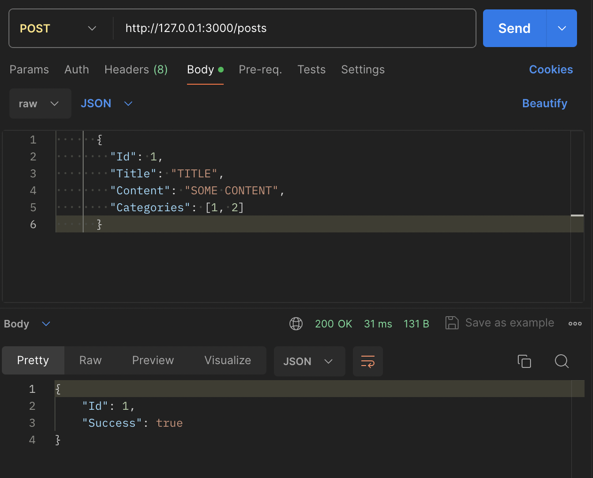
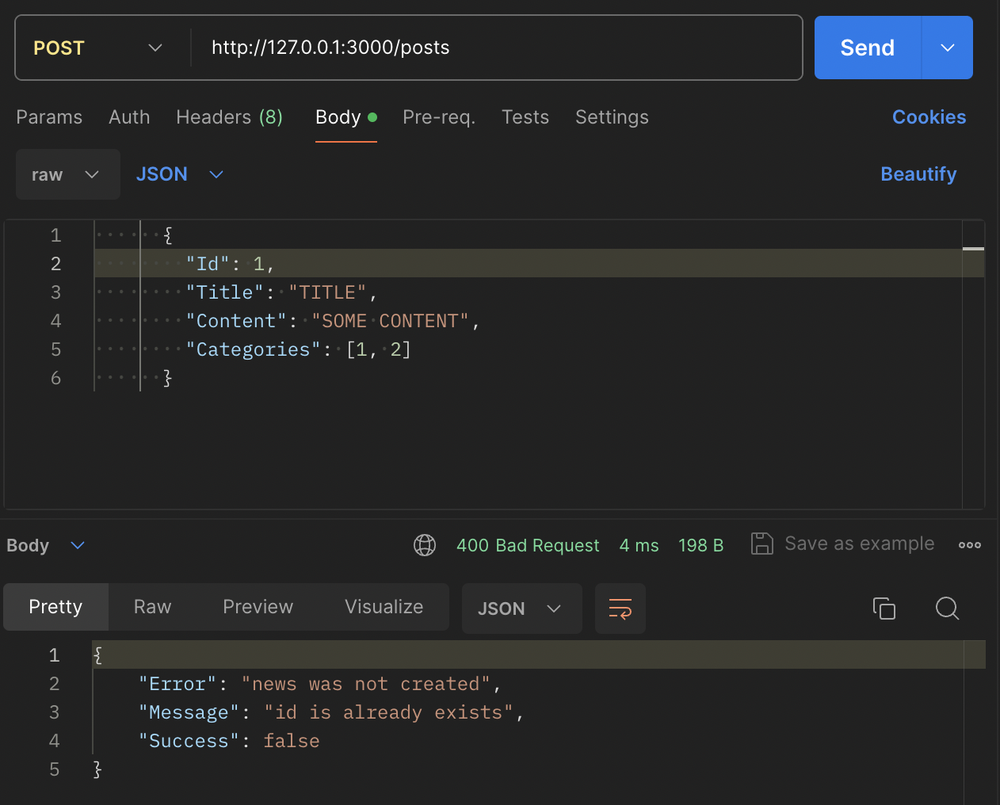
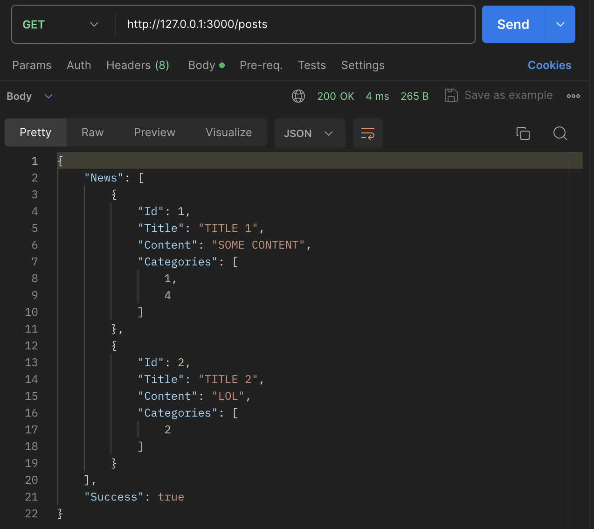

# News API
Проект представляет собой JSON REST сервер для управления новостями.  

Предоставляются следующие ручки:
```
POST /create - создание новости
POST /edit/:Id - изменение новости по Id
GET /list - список новостей
```

### Установка и запуск

```
make run
```
Команда запустит контейнеры и настроит необходимые сервисы.

### Работа с API
#### Создание новости
Чтобы создать новость, отправьте POST-запрос на эндпоинт /create с JSON-body в следующем формате:

В случе успешного создания новости, вы получите следующий ответ.



Если новость не была создана, то будет выведен ответ с соответствующей ошибкой.



#### Изменение новости
Чтобы изменить существующую новость, отправьте POST-запрос на эндпоинт /edit/:Id, где :Id - это идентификатор новости, которую вы хотите изменить.


Например, изменим поле "Content" и "Categories".


Как можем заметить, поле "Title" осталось прежним, значения остальных полей были обновлены.


#### Получение списка новостей
Чтобы получить список всех новостей, отправьте GET-запрос на эндпоинт /list.



В ответе вы получите JSON-объект со списком новостей.

#### Пагинация
По умолчанию отображается 5 новостей на странице.

