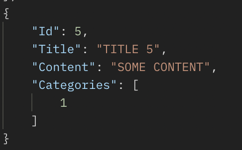
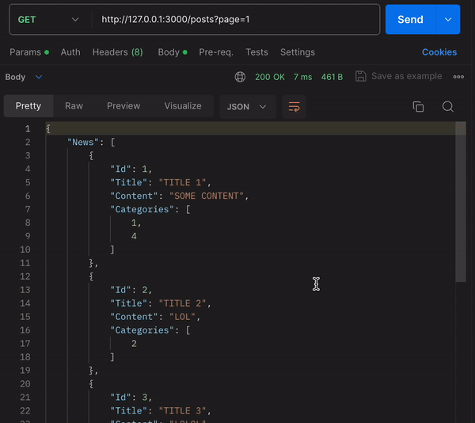

# News API
The project represents a JSON REST server for managing news.

The following endpoints are provided:
```
POST /create - create a news article
POST /edit/:Id - edit a news article by Id
GET /list - list of news articles
```

### Installation and Running

```
make run
```
This command will start the containers and configure the necessary services.

### Working with the API
#### Creating a News Article
To create a news article, send a POST request to the /create endpoint with a JSON body in the following format:

In case of successful news creation, you will receive the following response.


If the news article was not created, an error response will be displayed.


#### Editing a News Article
To edit an existing news article, send a POST request to the /edit/:Id endpoint, where :Id is the identifier of the news article you want to edit.


For example, let's change the "Content" and "Categories" fields.


As we can see, the "Title" field remained the same, while the values of the other fields were updated.




#### Getting a List of News Articles
To retrieve a list of all news articles, send a GET request to the /list endpoint.


You will receive a JSON object with a list of news articles in response.  

#### Pagination
By default, 5 news articles are displayed per page.


